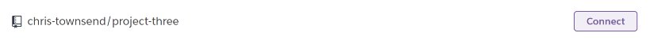
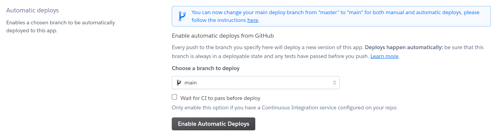

<h1 align="center">Portfolio Project Three - Python</h1>

## Live Site
[Chris's Hangman](https://chris-hangman.herokuapp.com/)

#

## Repository
[https://github.com/chris-townsend/project-three](https://github.com/chris-townsend/project-three)

***

## Contents
- [Objective](#objective)
- [Brief & Target Audience](#brief)
- [User Experience(UX)](#user-experience-ux)
- [Design](#design)
    - [Colour Scheme](#colour-scheme)
- [Logic & Flow](#logic-&-flow)
- [Features](#Features)
    - [Features Left to Implement](#Future-Features)
    - [Languages Used](#languages-Used)
- [Technologies Used](#programs-frameworks--libraries-used)
- [Testing](#testing)
    - [W3C Validator Results](#homepage)
    - [Google Lighthouse Results](#lighthouse-homepage)
    - [JShint Results](#jshint-homepage)
    - [Testing Stories for UX](#testing-user-stories-from-user-experience-ux-section)
    - [Further Testing](#Further-Testing)
- [Bugs](#Known-Bugs)
- [Deployment](#Deployment)
    - [GitHub Pages](#GitHub-Pages)
    - [Forking the GitHub Repository](#forking-the-github-repository)
    - [Making a local Clone](#making-a-local-clone)
- [Credits](#Credits)
    - [Content](#Content)
    - [Media](#Media)
    - [Acknowledgements](#acknowledgements)

***

## Objective
#
In this project I intend to design a hangman game using Python, the project should run in a CLI and deployed using Heroku. The computer will generate a random word and the user will have 8 lives to guess the correct word by inputting letters or whole words. 

***

## Brief
# 
The game will be designed for a target audience of 12 years + as some of the words are hard to guess, however the game will be fun to play by all, especially developers who want to take 5 minutes out. The game will ask for a username to make it more personal to the user and it will contain a menu with command keys to be input. If incorrect keys are inputted, the user will be presented with an error message. The finished product should be error free, give clear instructions regarding use and valid inputs and have a varied amount of words to allow replayabillity. 
***

## User Experience (UX)
#

-   ### User Requirements

    - As a first time user, I want to easily understand how to play the game.

    - As a user I want to be able to see my current score.

    - As a user I want to receive an alert at the end of gameplay with my final score. 

    - As a user I want simple gameplay which is easy to play again.

    - As a returning user, If I play again, I want different words to guess
    
     ***

-   ### Design
#
-   #### Colour Scheme
    
 The colour scheme for this project relies heavily on the colours available through a system call called OS which is built-in within Python. The package has allowed a few colours to be applied to text within the terminal. The colours outside the terminal have been designed to match the style of the game. The 'Run Program' button has the original style with added style to the scroll bar to make it blend in with the terminal screen. Contrast checks have been done to ensure the 'Run Program' button and text present are of a high enough contrast to be easily read.

***
   
        
*   ### Logic & Flow
# 
- During the planning phase of this project I spent some time planning the logic behind the application. I created a flow chart which allowed me to follow the application as the project was being built. The chart has been made using [Diagrams.net](https://www.diagrams.net/) 

***    

## Features
#

1. <b> Getting User Input -</b> On start up, the game will ask the user to input a name. This has been accomplished by using the python input() function. The prompt within the input is a string which represents a default message to the user.
 

 - If a user inputs any characters other than letters, a default error message will appear. isalpha() was used to accomplish this, as you can see from the screen shot below, no special characters, numbers or spaces are accepted. I have used the colour Red to print Errors to the user.
 

2. <b>Game Menu -</b> When a correct name has been inputted, the user will be greeted with a welcome message followed by a menu with two options. 
- Press P to play the game
- Press I for Instructions 

- The computer will only accept the valid keys or else an error message will appear:

6. 

7. 

8. 

9. 

10. 

11. 

12. 

13. 
***
## Future Features
#
With more time, I would have liked to of implemented the following ideas:

- Display a high scores list linked to local storage - At first I had my contact modal set up as a high score list but changed it to a contact form due to not having enough information about JSON.stringify and local storage. Below is an image of the original high scores button. 

- Add objects to increase the difficulty - Add an object such as a rabbit and if that object is hit you minus one point. 

- Add a different mole image to show when a mole has been hit, in case the sound effects don't work on a particular device.

### Languages Used
#

-   [Python](https://en.wikipedia.org/wiki/Python_(programming_language))
-   [HTML5](https://en.wikipedia.org/wiki/HTML5)
-   [CSS3](https://en.wikipedia.org/wiki/Cascading_Style_Sheets)

### Programs, Frameworks & Libraries Used
#

- [Balsamiq:](https://balsamiq.com/) Balsamiq was used to create the wireframes during the design process.

- [Diagrams.net:](https://www.diagrams.net/) Diagrams.net is an open source technology stack for building diagramming applications, It was very useful for created my flow charts when planning the logic for my project.

- [Pixlr:](https://pixlr.com/x/) Pixlr was used to resize and change the format of my images.

- [Google DevTools:](https://developer.chrome.com/docs/devtools/) Once the website was made to a basic deployment level, Google DevTools was used frequently to resize objects within the site, very helpful for making my website responsive.

- [Git:](https://git-scm.com/) Git was used for version control by utilizing the Gitpod terminal to commit to Git and Push to GitHub.

- [GitHub:](https://github.com/) GitHub is used to store the projects code after being pushed from Git.

- [Heroku:](http://heroku.com/) Heroku is a cloud platform that lets people build, deliver, monitor and scale apps. It supports several programming languages. Heroku was used for the deployment of this project.

- [W3C Markup Validator:](https://validator.w3.org/) This site was used to ensure that my HTML and CSS was error free. I had to push my code to ensure it was updated and then add the URL of the website to the address bar which then checked for errors or warnings.

- [Favicon Generator:](https://favicon.io/favicon-converter/) This was used to create my favicon icon. 

- [Slack:](https://slack.com/intl/en-gb/) Slack is a online messaging service which allows people to collaborate with their workspaces. Slack was incredibly useful for advice from students and tutors.

- [YouTube:](https://www.youtube.com/) YouTube is a free video sharing website, it has been very useful for watching videos on python functions.

- [JSHint Validator:](https://jshint.com/) Jshint was used to validate my JavaScript code. It showed any warnings and errors within my code. 

- [Ascii Art generator:](https://www.ascii-art-generator.org/) This art generator was used to create my diagrams in my diagrams.py folder. It has an option to select the max line width which was really handy as there is a max width of 80 characters long in the terminal.

- [PEP8 Validator:](http://pep8online.com/) The PEP8 validator was used to validate my python code, you can paste your code or upload the file to see the results. Its built with a backend Python framework called Flask. 

- [Random Lists:](https://www.randomlists.com/random-words?dup=false&qty=300) A list of 300 random  words in words.py. You can choose the dataset and the quantity of words you require. 

## Testing
#
### Python Testing

I have performed multiple tests manually through-out the development of the project, this includes on the deployed site and in the local gitpod terminal. I have purposefully inputted incorrect data to confirm error messages were capturing wrong inputs. The code has been tested through the [PEP8](http://pep8online.com/) Linter and the results are shown below:

### PEP 8

#### run.py

#### words.py

#### hangman.py

#### diagrams.py

### W3C Validator
- The W3C HTML & CSS Validator was used to validate the project, the results are shown below with no errors.

#### [HTML Result](https://validator.w3.org/nu/?doc=https%3A%2F%2Fchris-hangman.herokuapp.com%2F)

#### [CSS Result](https://jigsaw.w3.org/css-validator/validator?uri=https%3A%2F%2Fchris-hangman.herokuapp.com%2F&profile=css3svg&usermedium=all&warning=1&vextwarning=&lang=en)

### Google Lighthouse 

- I have run the site through Google Chrome's Lighthouse audit application and the results are shown below:

### JSHint

- I have run the site through JSHint's audit application and the results are shown below:

### Testing User Stories from User Experience (UX) Section
#
 1. As a first time user, I want to easily understand how to play the game.

**Simple and informative text on the homepage buttons which allows the user to click on the Instructions button and read up on how to play the game.**

 2. As a user I want the ability to control any background sounds playing. 

 **At the bottom of the homepage is an option to switch the audio on/off and Pause. When you click play the button switches to Pause and when clicked again, returns to Play**

 

 3. As a user I want to be able to see my current score.

 **The scoreboard can easily be seen during game play at the top of the screen, alongside the time remaining.**

 

 4. As a user I want to receive an alert at the end of gameplay with my final score.

 **A pop up message alerts the user at the end of gameplay to let the user know that the game is over and gives them a final score.**

 

 5. As a user I want simple gameplay which is easy to play again.

 **The game will restart after clicking ok to the alert after game play. The user has the choice to play again or click the home button to return to the home screen.**

 

 6. As a frequent user, I want to learn more about the developer and see if they have added any new content. 

 **At the bottom of each pop up modal for Contact and Instructions are two social media icons, LinkedIn and Github, there is an effect of hover of the buttons to register interactivity with the user.**

 

 7. As a user I want the ability to play the game on multiple devices.

 **The game has been tested on mutiple devices and tested using responsinator and google dev tools to add specific media queries for certain screen sizes.**

 

 
### Further Testing
#
Throughout building my JavaScript game, I had to do various console.log() tests to ensure my functions and variables were working and linking up correctly. I used the console option within google dev tools to validate the code was working correctly. Below are some screenshots of some tests taken while figuring out some errors within the console.

The above screenshot shows me trying to debug an error I had in the console. It was showing that I had an uncaught type error at my countDown function. I used console.log() to print the timer to ensure this was working. The error was overcome by creating a new JavaScript file to prevent the timer being called on the homepage.

-   The Website was tested on Google Chrome, Internet Explorer and Microsoft Edge.
-   A large amount of testing was done to ensure that everything was linking correctly.
-   Friends and family members were asked to review the game and point out any bugs or problems.

### Known Bugs
#
Throughout the project I encountered a number of bugs, some of which were solved and some not which are stated below:

#### Console Bugs

***
## Deployment

### Heroku
#
The project was deployed to Heroku using the following steps...

1. Log in to your [Heroku dashboard](https://dashboard.heroku.com/apps) and click 'New' at the top right. Select 'Create new app' from the drop-down menu.  

2. Create a name for your app and select the correct region for your location.
    

3. Select "Settings" from the tabs at the top of the screen.

    

4. Select "Reveal Config Vars".

    

    - Input `PORT` and `8000` as one config var and click add.  
    - Input `CREDS` and the content of your Google Sheet API creds file as another
      config var and click add. 

      *This step is only applicable if your using a Google sheet API to add*

    

5. Select "Add buildpack" from the Settings tab.
    

6. From the list of buildpacks, Add "Python" and "Nodejs" and click save changes.

 - Python must be the first buildpack, followed by Nodejs. The buildpacks can be dragged into position.

7. Select "Deploy" from the tabs section at the top of the page.

 - Select "Connect to GitHub" from deployment method. 
 

 - Search for the repository to connect to by name.
 

 - Click "Connect".
 

 - Your app should now be connected to your GitHub account.
 

8. Select "Enable Automatic Deploys" for automatic deployments.
 

 - If you would like to deploy manually, select "Deploy Branch". If you manually deploy, you will need to re-deploy each time the repository is updated.
 

 - For the first time deploying to Heroku you may have to deploy manually but if you select automatic deploys it will update from then onwards.

 - Click "View" to view the deployed site.

 

### Forking the GitHub Repository
#

By forking the GitHub Repository you can make a copy of the original repository You can view and/or make changes without affecting the original repository by using the following steps..

1. Log in to GitHub and locate the [GitHub Repository](https://github.com/) you would like to fork.

2. At the top of the Repository, just above the "Settings" Button on the menu, locate the "Fork" Button and you should now have a copy of the original repository in your account.

### Making a Local Clone
#

1. Log in to GitHub and locate the [GitHub Repository](https://github.com/)

2. On the repository main page, click the drop down menu called Code.

    

3. To clone the repository using HTTPS, copy the link.

    

4. Open Git Bash
5. Change the current working directory to the location where you want the cloned directory to be made.
6. Type `git clone`, and then paste the URL you copied in Step 3.

7. Press Enter. Your local clone will be created.

***
## Credits

### Content
#
Helpful tutorials I used to help me with coding some of the design ideas were:

- [Ania Kubów Whac-a-mole in JavaScript](https://www.youtube.com/watch?v=rJU3tHLgb_c&t=1194s)

- [JavaScript Game Tutorial for Beginners](https://www.youtube.com/watch?v=RTb8icFiSfk&list=RDCMUCEqc149iR-ALYkGM6TG-7vQ&index=16)

- [How to create an animated cursor - help from webanimation](https://webanimation.blog/blog/how-to-create-a-custom-cursor-without-using-canvas)

- [Send Email using JavaScript](https://www.youtube.com/watch?v=x7Ewtay0Q78)

Various resources used to learn were:
- [W3Schools](https://www.w3schools.com/)
- [Stack Overflow](https://stackoverflow.com/)
- [Codecademy](https://www.codecademy.com/)

### Media
#
The Images used on my site have been taken from: 

### Acknowledgements
#
-  [W3 Schools How to create a modal](https://www.w3schools.com/howto/howto_css_modals.asp)

-  [JavaScript 30 Day Coding Challenge](https://javascript30.com/)

-  I would like to thank my Mentor Darío Carrasquel for guidance throughout the project.
