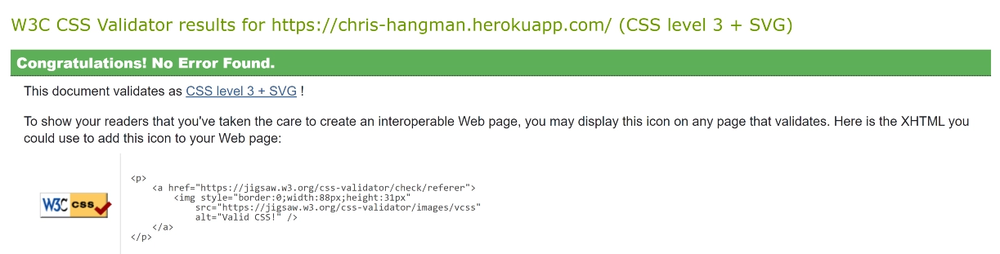

<h1 align="center">Portfolio Project Three - Chris's Hangman Using Python</h1>

## Live Site
[Chris's Hangman](https://chris-hangman.herokuapp.com/)

#

## Repository
[https://github.com/chris-townsend/project-three](https://github.com/chris-townsend/project-three)

***

## Contents
- [Objective](#objective)
- [Brief & Target Audience](#brief)
- [User Experience(UX)](#user-experience-ux)
- [Design](#design)
    - [Wireframes](#wireframes)
    - [Colour Scheme](#colour-scheme)
- [Logic & Flow](#logic--flow)
- [Features](#features)
    - [Features Left to Implement](#future-features)
    - [Languages Used](#languages-used)
- [Technologies Used](#programs-frameworks--libraries-used)
- [Testing](#testing)
    - [PEP8 Results](#pep-8)
    - [W3C Validator Results](#w3c-validator)
    - [Google Lighthouse Results](#google-lighthouse)
    - [JShint Results](#jshint)
    - [Testing Stories for UX](#testing-user-stories-from-user-experience-ux-section)
    - [Further Testing](#further-testing)
- [Bugs](#known-bugs)
- [Deployment](#deployment)
    - [Heroku](#heroku)
    - [Forking the GitHub Repository](#forking-the-github-repository)
    - [Making a local Clone](#making-a-local-clone)
- [Credits](#credits)
    - [Content](#content)
    - [Media](#media)
    - [Acknowledgements](#acknowledgements)

***

## Objective
#
In this project I intend to design a hangman game using Python, the project should run in a CLI and deployed using Heroku. The computer will generate a random word and the user will have 8 lives to guess the correct word by inputting letters or whole words. 

***

## Brief
# 
The game will be designed for a target audience of 12 years +  due to some of the words being hard to guess, however, the game will be fun to play for all, especially developers who want to take 5 minutes out. The game will ask for a username to make it more personal to the user and it will contain a menu with command keys to be input. If incorrect keys are inputted, the user will be presented with an error message. The finished product should be error-free, give clear instructions regarding use and valid inputs, and have a varied amount of words to allow replayability. 
***

## User Experience (UX)
#

-   ### User Requirements

    - As a first-time user, I want to easily understand how to play the game.

    - As a user, I want to be able to see my current score.

    - As a user, I want to receive an alert at the end of gameplay with my final score. 

    - As a user, I want simple gameplay which is easy to play again.

    - As a returning user, If I play again, I want different words to guess.
    
     ***

-   ### Design
#

-   #### Wireframes
Due to the style of the project, the wireframe has been kept basic. Some added styles might have changed since initially creating the wireframe. I have changed the original `run program` button to `run game` to fit the style of the content being displayed.

-   #### Colour Scheme
    
 The colour scheme for this project relies heavily on the colours available through a system call called OS. The OS module is part of the standard library within Python 3 but you must still import it. The package has allowed a few colours to be applied to text within the terminal. The colours outside the terminal have been designed to match the style of the game. The 'Run Game' button has the original style with added style to the scroll bar to make it blend in with the terminal screen. Contrast checks have been done to ensure the 'Run Game' button and text present are of a high enough contrast to be easily read.

I found this image while searching for how to add colour to the terminal on [Stack Overflow](https://stackoverflow.com/). It was very useful for deciding on what colours to use for my project. *note: `\33[5m` and `\33[6m` are blinking. credit to [qubodup](https://stackoverflow.com/users/188159/qubodup) for the image and great post!*

The colours used for text throughout the game are:

- `YELLOW` = `'\033[33m'`
  - Used for Input When a user first enters their name
  - Display for Instructions
  - When a user wins a game
  
- `RED` = `'\033[0;31m'`
  - Used for the main heading Chris's Hangman
  - Used for Error messages when a user inputs a wrong key
  - When a user loses a game
  - When a user only has 1 live left print hangman and lives left

- `CYAN` = `'\033[36m'`
  - Return to the menu from the Instructions text
  - Prints a line under the correct word after gameplay.
   
- `WHITE` = `'\033[37m'`
  - Used to print the hangman until 1 live left
  - Prints lives left until 1 life left
  - User input for guessing a letter

***
   
        
*   ### Logic & Flow
# 
- During the planning phase of this project I spent some time planning the logic behind the application. I created a flow chart that allowed me to follow the application as the project was being built. The chart has been made using [Diagrams.net](https://www.diagrams.net/).

***    

## Features
#

<b> Getting User Input -</b> On startup, the game will ask the user to input a name. This has been accomplished by using the python input() function. The prompt within the input is a string that represents a default message to the user.
 

 - If a user inputs any characters other than letters, a default error message will appear. isalpha() was used to accomplish this, as you can see from the screenshot below, no special characters, numbers, or spaces are accepted. I have used the colour Red to print Errors to the user.

 

<b>Game Menu -</b> When a correct name has been inputted, the user will be greeted with a welcome message followed by a menu with two options. 
- Press P to play the game
- Press I for Instructions 

- The computer will only accept the valid keys or else an error message will appear. The error message prints in red to show an error or wrong input has happened.

<b>Instructions -</b> A user can view the rules and how to play hangman by clicking on "I" on the menu screen.

- The computer will ask for the Enter key to return to the menu, if an incorrect key has been pressed, an alert in red will alert the user and the menu will be presented, P to play or I for Instructions. 

<b>Generate a random word -</b> A random word is selected from a list of chosen words from words.py. This is been accomplished by importing the built-in *random* module. The module has a range of methods but the one used to retrieve the random word is random.choice is taken from WORDS in words.py.  

- The list of words from words.py contains 300 words, which have been selected at random from [Random Lists](https://www.randomlists.com/random-words?dup=false&qty=300).

<b>Getting User Input during gameplay -</b> After clicking P for Play, the user will be presented with the hidden word, lives remaining, and the hangman diagram. The hidden letters within the word are presented by a '_'. The player's input is registered as either getting a letter or word correct or incorrect. In the below screenshot, you can see that the word has six letters.

- Getting an input correct will result in a letter being shown to replace '_' within the word.

- Getting an input incorrect will result in a life being lost and the hangman diagram gets a part added with each life lost. 

- When only 1 life is remaining the user will be alerted by the hangman and lives left being printed in red.

- A user can only input letters while playing the game and no lives will be lost if a number or special character is entered by mistake. An error message briefly alerts the user 'Guess must be letters only'. You can only see this message very briefly because of the way I have the display() function called in the game logic. The screen gets cleared when a letter or word is input.

- A user can also guess whole words if they think they know the word, this prevents having to type in each letter.

<b>Diagrams.py -</b> Within this folder are my main diagrams, they have been created using the online [Ascii Art generator](https://www.ascii-art-generator.org/).

 - For when a game is won, 'You Win' is displayed.
 
 
 - Below the 'You Win' diagram I have used an F-string to print the correct word and the number of lives remaining after guessing the correct word.

 

 - For when a game is Lost, 'Game Over' is displayed. I have used an F-string to print the correct word so that the user know's what missing letters they needed.

 

<b>Restart Game -</b> At the end of gameplay, the user has the choice to either restart the game or return to the menu.

 
 - Only correct keys are accepted otherwise a ValueError message pops up alerting the user.

 

 - If a user decides they no longer want to play they can return to the menu by clicking the 'N' key on the play again option.

 

 <b>Favicon -</b> I have added a favicon to make the site look more distinguishable and professional. As you might be able to see from previous commits, getting this favicon icon to appear was difficult. I resorted to hosting the image on [ImgPile](https://imgpile.com/) and linking it to the head of my index and layout HTML pages.

 

 

***
## Future Features
#
With more time, I would have liked to of implemented the following ideas:

- <b>Scoring System -</b> Display a high scores list by using a Google sheet to store the data.

- <b>Catagories for words with a hint -</b> Turn words.py into a dictionary with different categories for words. Give the user a hint at the start of gameplay hinting what category the word is in. 

- <b>Add difficulty option -</b> Change the game logic so that at the menu screen the user has the choice of easy, medium, and hard. On an easy setting, the user could have 12 lives whereas on the hard setting, the user could have 4 lives. 

### Languages Used
#

   )

   

   

### Programs, Frameworks & Libraries Used
#

- [Balsamiq:](https://balsamiq.com/) Balsamiq was used to create the basic wireframe during the design process.

- [Diagrams.net:](https://www.diagrams.net/) Diagrams.net is an open source technology stack for building diagramming applications, It was very useful for creating my flow chart when planning the logic for my project.

- [Pixlr:](https://pixlr.com/x/) Pixlr was used to resize and change the format of my images.

- [Google DevTools:](https://developer.chrome.com/docs/devtools/) Once the website was made to a basic deployment level, Google DevTools was used frequently to resize objects within the site, very helpful for making my website responsive.

- [Python Tutor:](https://pythontutor.com/) Python Tutor was used for helping step through non-functioning code and resolve issues.

- [Git:](https://git-scm.com/) Git was used for version control by utilizing the Gitpod terminal to commit to Git and Push to GitHub.

- [GitHub:](https://github.com/) GitHub is used to store the project's code after being pushed from Git.

- [Heroku:](http://heroku.com/) Heroku is a cloud platform that lets people build, deliver, monitor, and scale apps. It supports several programming languages. Heroku was used for the deployment of this project.

- [W3C Markup Validator:](https://validator.w3.org/) This site was used to ensure that my HTML and CSS were error-free. I had to push my code to ensure it was updated and then add the URL of the website to the address bar which then checked for errors or warnings.

- [Favicon Generator:](https://favicon.io/favicon-converter/) This was used to create my favicon icon. 

- [Slack:](https://slack.com/intl/en-gb/) Slack is an online messaging service that allows people to collaborate with their workspaces. Slack was useful for advice from students and tutors.

- [JSHint Validator:](https://jshint.com/) Jshint was used to validate the JavaScript code. It shows any warnings and errors within my code. 

- [Ascii Art generator:](https://www.ascii-art-generator.org/) This art generator was used to create my diagrams in my diagrams.py folder. It has an option to select the max line width which was handy as there is a max width of 80 characters long in the terminal.

- [PEP8 Validator:](http://pep8online.com/) The PEP8 validator was used to validate my python code, you can paste your code or upload the file to see the results. It's built with a backend Python framework called Flask. 

- [Random Lists:](https://www.randomlists.com/random-words?dup=false&qty=300) A list of 300 random  words in words.py. You can choose the dataset and the number of words you require. 

- [ImgPile:](https://imgpile.com/) A free unlimited cloud image hosting website, used to host my image for my favicon.

- [.random:](https://docs.python.org/3/library/random.html) The random library was used to randomly assign a word out of a choice of 300 words from words.py.

## Testing
#
### Python Testing

I have performed multiple tests manually throughout the development of the project, this includes on the deployed site and in the local GitPod terminal. I have purposefully inputted incorrect data to confirm error messages were capturing wrong inputs. The code has been tested through the [PEP8](http://pep8online.com/) Linter and the results are shown below:

### PEP 8

#### run.py

#### words.py

#### hangman.py

#### diagrams.py

### W3C Validator
The W3C HTML & CSS Validator was used to validate the project, the results are shown below with no errors reported.

#### [HTML Result](https://validator.w3.org/nu/?doc=https%3A%2F%2Fchris-hangman.herokuapp.com%2F)

#### [CSS Result](https://jigsaw.w3.org/css-validator/validator?uri=https%3A%2F%2Fchris-hangman.herokuapp.com%2F&profile=css3svg&usermedium=all&warning=1&vextwarning=&lang=en)

### Google Lighthouse 

I have run the site through Google Chrome's Lighthouse audit application and the results are shown below:

### JSHint

I have used JSHint's linter to check index.js and the results are shown below:

The unused variable and undefined variables are related to the terminal supplied by Code Institute. As the code is not my own, I have left it as it is.

### Testing User Stories from the User Experience (UX) Section
#
 1. As a first-time user, I want to easily understand how to play the game.

**Simple and informative text on the menu screen where the user can click 'I' which opens the Instructions page. The Instructions are designed to be easy to read and easy to navigate after gameplay.**

 2. As a user I want to be able to see my current score.

 **You can see your current score as lives remaining, you start with 8 lives and if you get a letter wrong you lose a life and the hangman starts to grow.**

 

 3. As a user I want to receive an alert at the end of gameplay with my final score.

 **At the end of gameplay, the computer alerts the user with how many lives are left if a word gets completed. Otherwise, if a word is not completed within 8 attempts, the gameplay is over and game over is displayed.**

 

 4. As a user I want simple gameplay which is easy to play again.

 **The game is easy to play again by simply pressing the 'Y' key on the options menu after gameplay. The user has the choice to play again or 'N' to return to the menu screen.**

 5. As a returning user, If I play again, I want different words to guess

 **There are 300 words available which are chosen at random from words.py**

 
### Further Testing
#
Throughout building my Python project, I had to do various tests to ensure my functions and variables were working and linking up correctly.

The above screenshot shows me testing if a new random word will appear each time I print the function. I have used a print statement to check this. The words are randomly selected from words.py and the random module has been added at the top of the run.py file. In the end, I didn't end up using this randomword() function but it allowed me to test whether the random word is being generated correctly. 

-   The Website was tested on Google Chrome, Internet Explorer and Microsoft Edge.
-   A large amount of testing was done to ensure that everything was linking correctly.
-   Friends and family members were asked to review the game and point out any bugs or problems.

### Known Bugs
#
Throughout the project I encountered several bugs, some of which were solved and some not which are stated below:

While building my diagrams, I had numerous errors stating invalid escape sequences, This was easily resolved by adding in an extra `\` or `/` where necessary.

I had a couple of errors with my check_letter function and Python tutor was handy in resolving this. At first, I had `reveal` as a global but after doing some more research I found out that this was not needed in my code. 

I was also given a warning about iterating with range and len so I decided to use the enumerate method instead.

***
## Deployment

### Heroku
#
The project was deployed to Heroku using the following steps...

1. Log in to your [Heroku dashboard](https://dashboard.heroku.com/apps) and click 'New' at the top right. Select 'Create new app' from the drop-down menu.  

2. Create a name for your app and select the correct region for your location.
    

3. Select "Settings" from the tabs at the top of the screen.

    

4. Select "Reveal Config Vars".

    

    - Input `PORT` and `8000` as one config var and click add.  
    - Input `CREDS` and the content of your Google Sheet API creds file as another
      config var and click add. 

      *This step is only applicable if you're using a Google sheet API to add*

    

5. Select "Add buildpack" from the Settings tab.
    

6. From the list of buildpacks, Add "Python" and "Nodejs" and click save changes.

 - Python must be the first buildpack, followed by Nodejs. The buildpacks can be dragged into position.

7. Select "Deploy" from the tabs section at the top of the page.

 - Select "Connect to GitHub" from the deployment method. 
 

 - Search for the repository to connect to by name.
 

 - Click "Connect".
 

 - Your app should now be connected to your GitHub account.
 

8. Select "Enable Automatic Deploys" for automatic deployments.
 

 - If you would like to deploy manually, select "Deploy Branch". If you manually deploy, you will need to re-deploy each time the repository is updated.
 

 - For the first time deploying to Heroku you may have to deploy manually but if you select automatic deploys it will update from then onwards.

 - Click "View" to view the deployed site.

 

### Forking the GitHub Repository
#

By forking the GitHub Repository you can make a copy of the original repository You can view and/or make changes without affecting the original repository by using the following steps...

1. Log in to GitHub and locate the [GitHub Repository](https://github.com/) you would like to fork.

2. At the top of the Repository, just above the "Settings" Button on the menu, locate the "Fork" Button and you should now have a copy of the original repository in your account.

### Making a Local Clone
#

1. Log in to GitHub and locate the [GitHub Repository](https://github.com/).

2. On the repository main page, click the drop-down menu called Code.

    

3. To clone the repository using HTTPS, copy the link.

    

4. Open Git Bash
5. Change the current working directory to the location where you want the cloned directory to be made.
6. Type `git clone`, and then paste the URL you copied in Step 3.

7. Press Enter. Your local clone will be created.

***
## Credits

### Content
#
Helpful tutorials I used to help me with coding some of the design ideas were:

- [How To Code Hangman In Python - Tutorial For Beginners](https://www.youtube.com/watch?v=pFvSb7cb_Us)

- [Sanjin Dedic - Python Hangman Beginner to Advanced](https://www.youtube.com/watch?v=3_CX0aD9Fdg)

- [Python Hangman Game Tutorial for Beginners](https://www.youtube.com/watch?v=lJ7RhvNvsnc)

Various resources used to learn were:
- [W3Schools](https://www.w3schools.com/)
- [Stack Overflow](https://stackoverflow.com/)
- [Codecademy](https://www.codecademy.com/)

### Media
#
- The hangman favicon was taken from [Flaticon](https://www.flaticon.com/free-icons/).

### Acknowledgements
#
-  [How do I print colored text to the terminal? Stack Overflow](https://stackoverflow.com/questions/287871/how-do-i-print-colored-text-to-the-terminal)

-  [12 Beginner Python Projects - freeCodeCamp](https://www.youtube.com/watch?v=8ext9G7xspg)

- The terminal function and template for the deployable application were provided by [Code Institute](https://codeinstitute.net/). The template is available for public use by clicking [here](https://github.com/Code-Institute-Org/python-essentials-template) and after, clicking on `Use this template`.

-  I would like to thank my mentor Darío Carrasquel for guidance throughout the project.
