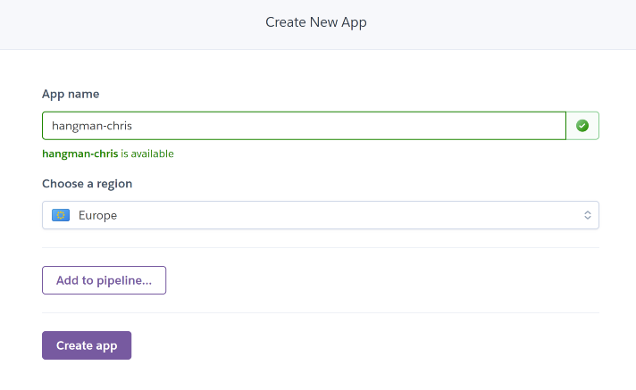

<h1 align="center">Portfolio Project Three - Python</h1>

## Live Site
[Chris's Hangman](https://chris-hangman.herokuapp.com/)

#

## Repository
[https://github.com/chris-townsend/project-three](https://github.com/chris-townsend/project-three)

***

## Contents
- [Objective](#objective)
- [Brief & Target Audience](#brief)
- [User Experience(UX)](#user-experience-ux)
- [Design](#design)
    - [Colour Scheme](#colour-scheme)
- [Logic & Flow](#logic-&-flow)
- [Features](#Features)
    - [Features Left to Implement](#Future-Features)
    - [Languages Used](#languages-Used)
- [Technologies Used](#programs-frameworks--libraries-used)
- [Testing](#testing)
    - [W3C Validator Results](#homepage)
    - [Google Lighthouse Results](#lighthouse-homepage)
    - [JShint Results](#jshint-homepage)
    - [Testing Stories for UX](#testing-user-stories-from-user-experience-ux-section)
    - [Further Testing](#Further-Testing)
- [Bugs](#Known-Bugs)
- [Deployment](#Deployment)
    - [GitHub Pages](#GitHub-Pages)
    - [Forking the GitHub Repository](#forking-the-github-repository)
    - [Making a local Clone](#making-a-local-clone)
- [Credits](#Credits)
    - [Content](#Content)
    - [Media](#Media)
    - [Acknowledgements](#acknowledgements)

***

## Objective
#
In this project I intend to design a hangman game using Python, the project should run in a CLI and deployed using Heroku. The computer will generate a random word and the user will have 8 lives to guess the correct word by inputting letters or whole words. 

***

## Brief
# 
The game will be designed for a target audience of 12 years + as some of the words are hard to guess, however the game will be fun to play by all, especially developers who want to take 5 minutes out. The game will ask for a username to make it more personal to the user and it will contain a menu with command keys to be input. If incorrect keys are inputted, the user will be presented with an error message. The finished product should be error free, give clear instructions regarding use and valid inputs and have a varied amount of words to allow replayabillity. 
***

## User Experience (UX)
#

-   ### User Requirements

    - As a first time user, I want to easily understand how to play the game.

    - As a user I want to be able to see my current score.

    - As a user I want to receive an alert at the end of gameplay with my final score. 

    - As a user I want simple gameplay which is easy to play again.

    - As a returning user, If I play again, I want different words to guess
    
     ***

-   ### Design
#
-   #### Colour Scheme
    
 The colour scheme for this project relies heavily on the colours available through a system call called OS which is built-in within Python. The package has allowed a few colours to be applied to text within the terminal. The colours outside the terminal have been designed to match the style of the game. The 'Run Program' button has the original style with added style to the scroll bar to make it blend in with the terminal screen. Contrast checks have been done to ensure the 'Run Program' button and text present are of a high enough contrast to be easily read.

***
   
        
*   ### Logic & Flow
# 
- During the planning phase of this project I spent some time planning the logic behind the application. I created a flow chart which allowed me to follow the application as the project was being built. The chart has been made using [Diagrams.net](https://www.diagrams.net/) 

***    

## Features
#

I have used [Responsinator](http://www.responsinator.com/) to check the responsiveness on different devices. The site is responsive on all devices displayed, including iOS devices. 

 - [Responsinator Results](http://www.responsinator.com/?url=https%3A%2F%2Fchris-townsend.github.io%2Fproject-two%2Findex.html)

#

1. <b> Whack A Mole Heading -</b> When you first arrive at the homepage, the main heading "Whack-A-Mole" flashes up and grow on the screen over 2 seconds. This has been accomplished by using *keyframes* with *image-grow*. I have added a suitable image of a man digging a hole under the main heading which also grows on the screen with the heading. The heading and image has been set to grow from a scale of 0.4 to 1.

2. <b> Homepage game animation -</b> Below my title, I have added an animation of the game. The moles will pop up randomly on the holes, This has been added as a bit of fun and to engage the user. I have created this from using the same JavaScript code as on my game page. At first this was showing quite a lot of errors in the console due to conflicting code trying to run on different pages - please see bugs/fixes.

3. <b> Home buttons -</b> Under my animation I have added 3 buttons, Play which directs you to the game page and a Contact and Instructions button which open up as pop-up modals. I have added style to the buttons when hovered over to give feedback to the user that is it interactive. Icons have been added to the Contact and Instructions buttons to give more UX. The icons have been taken from [Font Awesome](https://fontawesome.com/).

4. <b> Contact Modal -</b>  The contact modal has been styled similar to the instructions modal in terms of style and features. The X to close the modal changes colour on hover to give feedback to the user and also a user can click anywhere outside the modal to close it. 

*On hover of the send-email button, it turns green to give feedback to the user and shows interactivity.*

The contact form will pop up with a *required* warning box if the form has not been filled out correctly. It requires a name and email address for the form to be accepted.

Upon successful completion of the form, the form has been set up to be received via [Email.JS](https://www.emailjs.com/). This was made possible by following the steps below:

 - I first created an account with [Email.JS](https://www.emailjs.com/).

 - Next I set up an email service to link to my Email.js account.

 - Add a new email template and create three Ids which will correspond to your JavaScript function, one for name, email_id and message.

 - Copy the Email.js SDK into the head of your HTML file and add your personal public key to the emailjs.init parameter - It must be placed here to work.

 - Create a JavaScript file and create the function which gets the params from the contact form, add the necessary onclick feature and Id's to the HTML code. 
 
 

5. <b> Instructions Modal -</b> When the Instructions button is clicked the Instructions pop-up modal will appear and the background is darkened slightly to cover the homepage. The font used within this modal has been kept as Montserrat Alternates to keep the style consistent through-out. The Instructions have been kept simple so that they are easy to understand. The X to close the Instructions box changes colour on hover to give feedback to the user that it is interactive. It is located in the top right of the box. Another added feature for closing the modal is that a user can click anywhere outside the box to get back onto the homepage. This was implemented for the age demographic of the game; they might not see the X button in the top right corner and it is slightly harder to click on smaller objects with the mallet cursor. 

6. <b> Social Icons -</b> The social media icons that have been added to the footer of my modals have been made **interactive** by using the *hover*: *transform* function. This just adds a little extra UX  for the user and makes them acknowledge when the icons being hovered over. 

7. <b> Audio Buttons -</b> At the bottom of my homepage I have added a footer and within it are my audio buttons. The buttons give the user the option to play/pause and stop the audio. As the buttons are quite small, it's sometimes hard to click on them with the mallet cursor. I have added a pointer cursor so that the user knows when they are hovering over these buttons. The audio is a fun jazz track which was picked to be fairly short, just long enough to read the instructions before clicking onto the game page.  

8. <b> Mallet Cursor -</b> For extra customization and interactivity I have added a cartoon mallet as a cursor when using a mouse. The co-ordinates for the cursor have been set using JavaScript and CSS to allow an animation of a whacking hammer when the mouse is clicked.  

9. <b> Game Timer -</b> The Game will start immediately after clicking the Play button on the homepage and the timer will begin counting down from 20 seconds. The timer is displayed as Time Left and is easy to see while playing the game. When the timer reaches 0 an alert will pop up to tell the user the game is over and gives them there personal score. 

10. <b> Game Scoreboard -</b>  The Scoreboard can easily be seen during gameplay and its displayed as Your Score on the game page. The Scoreboard has been styled in a similar way to the home screen buttons. For every successful hit of a mole the score counter will +1. At the end of the game an alert will pop up with the number of successful moles hits.

11. <b> Home button on game page -</b> On the right-hand side of the game page, at the top, there is a home icon which when clicked will take you back to the homepage. I have added the CSS hover effect to add interactivity and to acknowledge the user when the button is being hovered over. The blue circle icon will hide into the green background and only the white house will be displayed.

12. <b> Mole Favicon -</b> A favicon was generated by uploading a mole image for the logo to [Favicon Generator](https://favicon.io/favicon-converter/). The icon is created and then saved in the game images folder and linked in the head section of the HTML. The favicon was created with the theme of Whack-A-Mole and chosen to be associated with this website as an extra visual support for the user. It should create brand awareness and recognizability for the user and help them find the page quicker and easier.

 13. <b> Game Sounds -</b> When the mouse is clicked, the user will hear a whack sound. On successful hit of a mole the user will hear a different whack sound. This has been added for extra interactivity and added engagement with the user. I couldn't find a suitable image for when a mole has been hit, so I decided to use sound instead. 

***
## Future Features
#
With more time, I would have liked to of implemented the following ideas:

- Display a high scores list linked to local storage - At first I had my contact modal set up as a high score list but changed it to a contact form due to not having enough information about JSON.stringify and local storage. Below is an image of the original high scores button. 

- Add objects to increase the difficulty - Add an object such as a rabbit and if that object is hit you minus one point. 

- Add a different mole image to show when a mole has been hit, in case the sound effects don't work on a particular device.

### Languages Used
#

-   [HTML5](https://en.wikipedia.org/wiki/HTML5)
-   [CSS3](https://en.wikipedia.org/wiki/Cascading_Style_Sheets)
-   [JavaScript](https://en.wikipedia.org/wiki/JavaScript)

### Programs, Frameworks & Libraries Used
#

- [Balsamiq:](https://balsamiq.com/) Balsamiq was used to create the wireframes during the design process.

- [Pixlr:](https://pixlr.com/x/) Pixlr was used to resize and change the format of my images.

- [Coolors:](https://coolors.co/) Coolors was used to pick a colour scheme and check contrast. 

- [TinyPNG:](https://tinypng.com/) All images within the project have been processed through their free compression tool.

- [Google Fonts:](https://fonts.google.com/) Google fonts were used to import the 'Montserrat Alternates' font into the style.css file.

- [Font Awesome:](https://fontawesome.com/) Font Awesome was used throughout the website to add icons for aesthetic and UX purposes.

- [Google DevTools:](https://developer.chrome.com/docs/devtools/) Once the website was made to a basic deployment level, Google DevTools was used frequently to resize objects within the site, very helpful for making my website responsive.

- [Git:](https://git-scm.com/) Git was used for version control by utilizing the Gitpod terminal to commit to Git and Push to GitHub.

- [GitHub:](https://github.com/) GitHub is used to store the projects code after being pushed from Git.

- [W3C Markup Validator:](https://validator.w3.org/) This site was used to ensure that my HTML and CSS was error free. I had to push my code to ensure it was updated and then add the URL of the website to the address bar which then checked for errors or warnings.

- [Favicon Generator:](https://favicon.io/favicon-converter/) This was used to create my favicon icon. 

 - [Slack:](https://slack.com/intl/en-gb/) Slack is a online messaging service which allows people to collaborate with their workspaces. Slack was incredibly useful for advice from students and tutors.

 - [YouTube:](https://www.youtube.com/) YouTube is a free video sharing website, it has been very useful for watching videos on basic JavaScript functions and games.

 - [Audio Compressor:](https://www.media.io/audio-compressor.html) Media.io was used to compress my audio files without loosing quality. 

 - [Compressor.io:](https://compressor.io/) This was used to reduce the size and load times of my images. 

 - [JSHint Validator:](https://jshint.com/) Jshint was used to validate my JavaScript code. It showed any warnings and errors within my code. 

## Testing
#

The W3C Markup Validator and W3C CSS Validator Services were used to validate every page of the project to ensure there were no syntax errors in the project. The results are shown below:

-   [W3C HTML Markup Validator](https://validator.w3.org/nu/?doc=https%3A%2F%2Fchris-townsend.github.io%2Fproject-two%2Findex.html) Results Homepage

-   [W3C HTML Markup Validator](https://validator.w3.org/nu/?doc=https%3A%2F%2Fchris-townsend.github.io%2Fproject-two%2Fgame.html) Results Gamepage

### Homepage

### Game Page

-   [W3C CSS Markup Validator](https://jigsaw.w3.org/css-validator/validator?uri=https%3A%2F%2Fchris-townsend.github.io%2Fproject-two%2Findex.html&profile=css3svg&usermedium=all&warning=1&vextwarning=&lang=en) Results

I have run the website through Google Chrome's Lighthouse audit application and the results are shown below:

- Mobile
### Lighthouse Homepage

###  Lighthouse Game Page

- Desktop
### Homepage

### Game Page

I have run the website through JSHint's audit application and the results are shown below:

### JSHint Homepage
The results for the homepage show no significant errors but emailjs is showing up as a undefined variable. This is part of the emailJS API which is linked in the head of the HTML document. SendMail is showing up as an unused variable but this is being used in the HTML document as an on click. The *stop* unused variable warning which is in fact a function is being used as an on click to stop the music playing on my homepage, All unused variable warnings have been tested to ensure there being used and working correctly. I was getting conflicting errors at first from code being used on different pages. To prevent the errors I made a game.js page to house all the game JavaScript code. The script.js file contains the cursor variable which allows the mallet cursor to work on all pages.

### JSHint Gamepage 

### JSHint script.js

### Testing User Stories from User Experience (UX) Section
#
 1. As a first time user, I want to easily understand how to play the game.

**Simple and informative text on the homepage buttons which allows the user to click on the Instructions button and read up on how to play the game.**

 2. As a user I want the ability to control any background sounds playing. 

 **At the bottom of the homepage is an option to switch the audio on/off and Pause. When you click play the button switches to Pause and when clicked again, returns to Play**

 

 3. As a user I want to be able to see my current score.

 **The scoreboard can easily be seen during game play at the top of the screen, alongside the time remaining.**

 

 4. As a user I want to receive an alert at the end of gameplay with my final score.

 **A pop up message alerts the user at the end of gameplay to let the user know that the game is over and gives them a final score.**

 

 5. As a user I want simple gameplay which is easy to play again.

 **The game will restart after clicking ok to the alert after game play. The user has the choice to play again or click the home button to return to the home screen.**

 

 6. As a frequent user, I want to learn more about the developer and see if they have added any new content. 

 **At the bottom of each pop up modal for Contact and Instructions are two social media icons, LinkedIn and Github, there is an effect of hover of the buttons to register interactivity with the user.**

 

 7. As a user I want the ability to play the game on multiple devices.

 **The game has been tested on mutiple devices and tested using responsinator and google dev tools to add specific media queries for certain screen sizes.**

 

 
### Further Testing
#
Throughout building my JavaScript game, I had to do various console.log() tests to ensure my functions and variables were working and linking up correctly. I used the console option within google dev tools to validate the code was working correctly. Below are some screenshots of some tests taken while figuring out some errors within the console.

The above screenshot shows me trying to debug an error I had in the console. It was showing that I had an uncaught type error at my countDown function. I used console.log() to print the timer to ensure this was working. The error was overcome by creating a new JavaScript file to prevent the timer being called on the homepage.

-   The Website was tested on Google Chrome, Internet Explorer and Microsoft Edge.
-   A large amount of testing was done to ensure that everything was linking correctly.
-   Friends and family members were asked to review the game and point out any bugs or problems.

### Known Bugs
#
Throughout the project I encountered a number of bugs, some of which were solved and some not which are stated below:

#### Console Bugs

***
## Deployment

### Heroku
#
The project was deployed to Heroku using the following steps...

1. Log in to your [Heroku dashboard](https://dashboard.heroku.com/apps) and click 'New' at the top right. Select 'Create new app' from the drop-down menu.  

2. Create a name for your app and select the correct region for your location.
    

3. Select "Settings" from the tabs at the top of the screen.

    

4. Select "Reveal Config Vars".

    

    - Input `PORT` and `8000` as one config var and click add.  
    - Input `CREDS` and the content of your Google Sheet API creds file as another
      config var and click add. 

      *This step is only applicable if your using a Google sheet API to add*

    

5. Select "Add buildpack" from the Settings tab.
    

6. From the list of buildpacks, Add "Python" and "Nodejs" and click save changes.

 - Python must be the first buildpack, followed by Nodejs. The buildpacks can be dragged into position.

7. Select "Deploy" from the tabs section at the top of the page.

 - Select "Connect to GitHub" from deployment method. 
 

 - Search for the repository to connect to by name.
 

 - Click "Connect".
 

 - Your app should now be connected to your GitHub account.
 

8. Select "Enable Automatic Deploys" for automatic deployments.
 

 - If you would like to deploy manually, select "Deploy Branch". If you manually deploy, you will need to re-deploy each time the repository is updated.
 

 - For the first time deploying to Heroku you may have to deploy manually but if you select automatic deploys it will update from then onwards.

 - Click "View" to view the deployed site.

 

### Forking the GitHub Repository
#

By forking the GitHub Repository you can make a copy of the original repository You can view and/or make changes without affecting the original repository by using the following steps..

1. Log in to GitHub and locate the [GitHub Repository](https://github.com/) you would like to fork.

2. At the top of the Repository, just above the "Settings" Button on the menu, locate the "Fork" Button and you should now have a copy of the original repository in your account.

### Making a Local Clone
#

1. Log in to GitHub and locate the [GitHub Repository](https://github.com/)

2. On the repository main page, click the drop down menu called Code.

    

3. To clone the repository using HTTPS, copy the link.

    

4. Open Git Bash
5. Change the current working directory to the location where you want the cloned directory to be made.
6. Type `git clone`, and then paste the URL you copied in Step 3.

7. Press Enter. Your local clone will be created.

***
## Credits

### Content
#
Helpful tutorials I used to help me with coding some of the design ideas were:

- [Ania Kubów Whac-a-mole in JavaScript](https://www.youtube.com/watch?v=rJU3tHLgb_c&t=1194s)

- [JavaScript Game Tutorial for Beginners](https://www.youtube.com/watch?v=RTb8icFiSfk&list=RDCMUCEqc149iR-ALYkGM6TG-7vQ&index=16)

- [How to create an animated cursor - help from webanimation](https://webanimation.blog/blog/how-to-create-a-custom-cursor-without-using-canvas)

- [Send Email using JavaScript](https://www.youtube.com/watch?v=x7Ewtay0Q78)

Various resources used to learn were:
- [W3Schools](https://www.w3schools.com/)
- [Stack Overflow](https://stackoverflow.com/)
- [Codecademy](https://www.codecademy.com/)

### Media
#
The Images used on my site have been taken from: 

### Acknowledgements
#
-  [W3 Schools How to create a modal](https://www.w3schools.com/howto/howto_css_modals.asp)

-  [JavaScript 30 Day Coding Challenge](https://javascript30.com/)

-  I would like to thank my Mentor Darío Carrasquel for guidance throughout the project.
